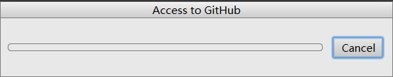
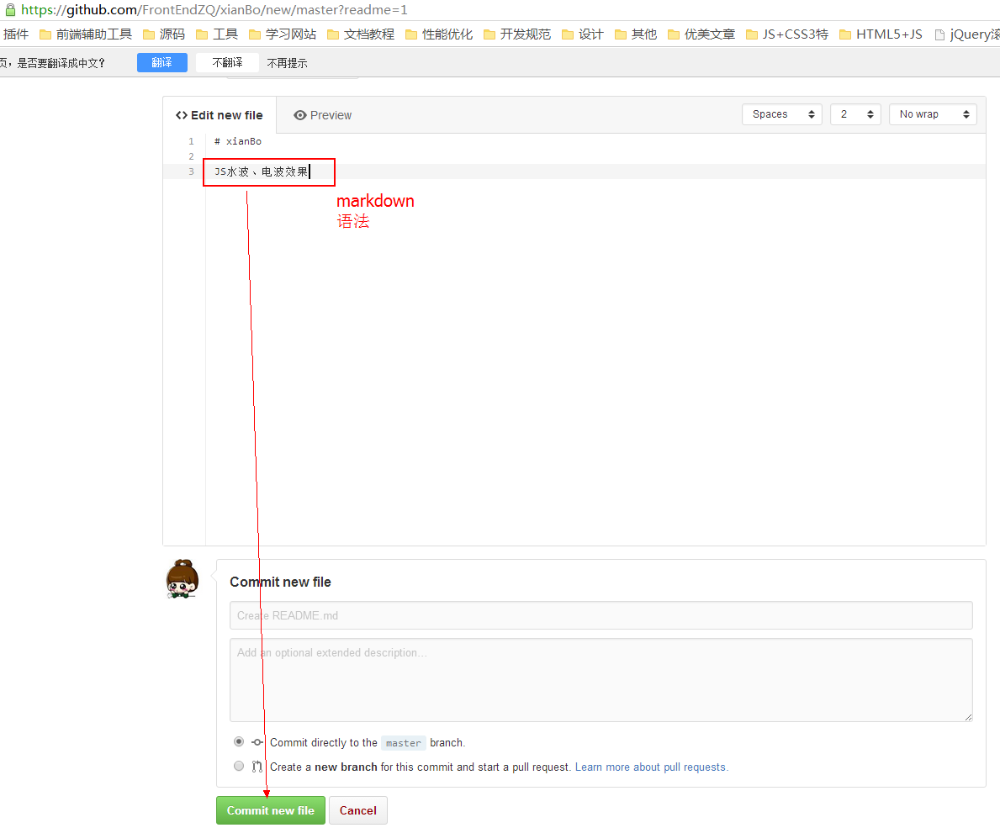
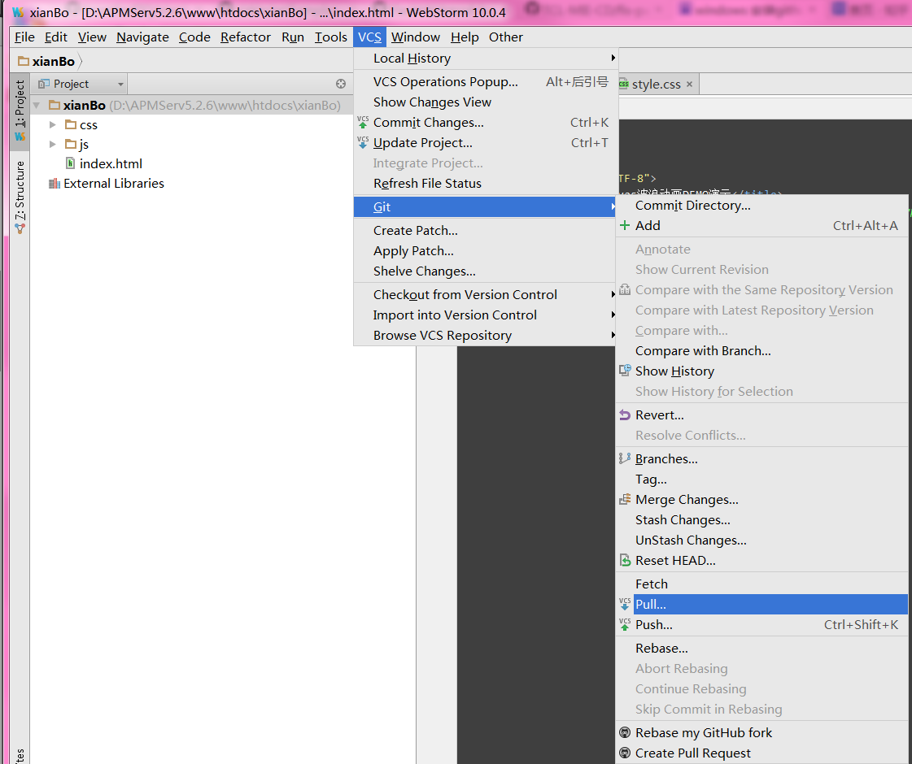

## webstorm集成git用法指南

### 一、准备工作

####  1、先到github官网注册账号，已有账户的直接登录

#### 2、安装Git

#### 3、安装webstorm，运行

### 二、设置webstorm
1)、file-->Settings

2)、进入github选项，输入账号、密码，点击“Test”按钮，输入密码验证，验证成功为图2

3)、进入git选项，找到git安装路径[Git的安装目录，记得先bin目录下的git.exe]，点击“确认”按钮

经过以上3步，webstorm关联git已初步完成。接下来测试共享你的项目：

确认项目名字，确认：

随后，在github官网可查看到webstorm刚刚共享的目录：

此时项目目录为空，因为还没有提交东东到github远程服务器。回到webstorm:

选择要提交的文件，填写更新信息，commit:

此时，文件被放在了一个缓存区，这里需要push操作，将文件推送到git远程服务器：

大功告成，现在就可以去git官网查看更新的文件啦^_^   你还可以为自己的DEMO添加一个说明文档，Add a README：

回到首页，会看到多了以下两项：

此时，你会发现，github官网添加了README文件，而本地webstorm项目库并没有这个文件，why？

远程服务器更新了东西，需要在本地先pull一下：

至此，webstorm关联git功能基本介绍完毕。如有更好见解，欢迎补充！

